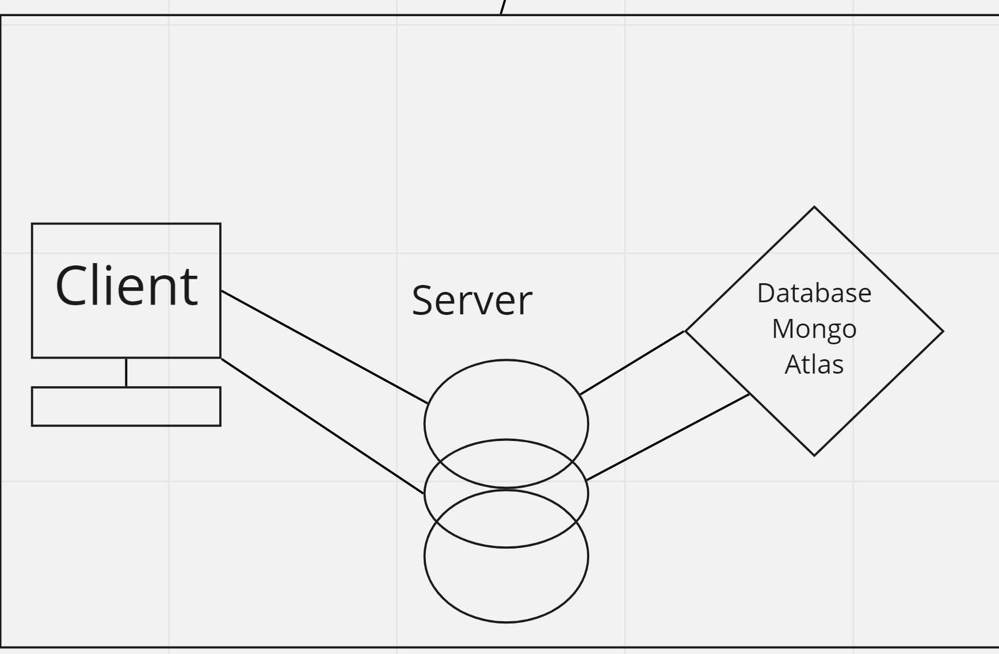

# Start your own "Can of Books" App

This repository has starter code to begin work on creating your own online bookshelf.

## What can books do?

Books are life-changing. They have the power to enlighten, educate, entertain, heal, and help us grow. Build out this code base to create an web app to track what books have impacted you, and what's recommended to read next.

## Use this template

Clone this repo to your own account with the green "Use this template" button. Then, add any collaborators. Now you are ready to start adding features! Deploy your site to let the world know which books have had the greatest impact on you, and what's recommended. Enjoy!

## Can of Books

 **Author**: Keelen Fisher | Robert Ball

## **Version**: 1.0.0

## Overview

* This is an application that utilizes MongoDB, Heroku and Netlify to deliver a collection of user curated books

## Getting Started

In order to run this app locally you will need to clone down the backend and front end can-of-books repos

[Front end](https://github.com/Keelen-Fisher/can-of-books-frontend)

[Back end](https://github.com/RDBALL/can-of-books-backend)

## Architecture

* Bootstrap

* JavaScript

* State and Props

* NoSQL (MongoDB)

* REACT.JS

## Change Log

---

---

## Estimates

Name of feature: Establish backend-server and deploy

Estimate of time needed to complete: 2 hours

Start time: 1:30pm

Finish time: 3:00pm

Actual time needed to complete: 1.5 hours

---

Name of feature: Establish frontend and deploy

Estimate of time needed to complete:4 hours

Start time: 3:00pm

Finish time: _____

Actual time needed to complete: _____

---

## Credit and Collaborations

[Keelen Fisher](https://github.com/Keelen-Fisher)

[Robert Ball](https://github.com/RDBALL)

---

### Logistical

What hours will you be available to communicate?

* Normal class hours following lecture

What platform will you use to communicate (ie. Slack, phone …)?

* Slack, remo

How often will you take breaks?

* Every hour and as needed

What is your plan if you start to fall behind?

* Communication

* Utilize TA support

* Reach out to Audrey

* Focus on the MVP - SIMPLIFY FROM THE START

Cooperative

*Make a list of each person's strengths.

*Keelen - Communication, Frontend component development

*Rob - CSS, Backend development

* How can you best utilize these strengths in the development of your application?

We will be able to combine our strengths in order to deliver a functional, styled app

* In what areas do you each want to develop greater strength?

Keelen - Being able to set state within react

Rob - Become more familiar with react front-end

* Knowing that every person in your team needs to understand the code, how do you plan to approach the day-to-day development?

Switch driver / navigator roles as we work through the daily feature task list

### Conflict Resolution

* What will be your group’s process to resolve conflict, when it arises?

Open communication: Honest, clear, feeling comfortable taking risks to clear the air, no grudges

Timeouts - Walk away when things get heated so they don’t escalate

Grab another member to mediate in the group

* What will your team do if one person is taking over the project and not letting the other members contribute?

Respectfully draw their attention to the behavior and give them an opportunity to wrap up their thoughts.

Hand off the conversation to another person.

* How will you approach each other and the challenges of the project knowing that it is impossible for all members to be at the exact same place in understanding and skill level?

Ask questions

Preschool mindset

Be cool
